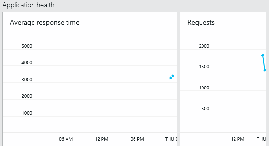
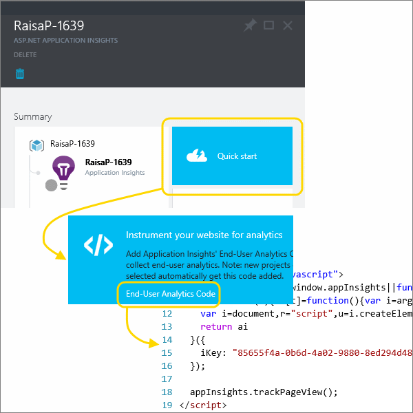
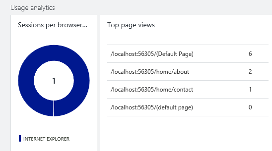

<properties title="Monitor your app's health and usage with Application Insights" pageTitle="Monitor your app's health and usage with Application Insights" description="Get started with Application Insights. Analyze usage, availability and performance of your on-premises or Microsoft Azure applications." metaKeywords="analytics monitoring application insights" authors="awills"  />

<tags ms.service="application-insights" ms.workload="tbd" ms.tgt_pltfrm="ibiza" ms.devlang="na" ms.topic="article" ms.date="01/01/1900" ms.author="awills" />
 
# Monitor your application's health and usage

*Application Insights is in preview.*

Make sure your application is performing well and satisfying your users. Application Insights will alert you to any performance issues and help you find and diagnose the root causes. It will let you trace user activities so that you can tune your app to their needs.

Application Insights can monitor Windows Phone apps, Windows Store apps, and web applications hosted on-premise or on virtual machines, as well as Microsoft Azure websites. 

You'll need [Visual Studio Update 3](http://go.microsoft.com/fwlink/?LinkId=397827) and an account in [Microsoft Azure](http://azure.com) (there's a free trial period).

1. [Add Application Insights](#add)
+ [Run your project](#run)
+ [See monitor data](#monitor)
+ [Set up web client monitoring](#webclient)
+ [Deploy your application](#deploy)
+ [Next steps](#next)

*Alternatively, if you want to monitor an existing web service without redeploying it or using Visual Studio, you can [install an agent on the server][redfield].*

## 1. Add Application Insights

### If it's a new project...

When you create a new project in Visual Studio 2013, make sure Application Insights is selected. 

If this is your first time, you'll be asked to provide your login for Microsoft Azure Preview, or to sign up. (It's different from your Visual Studio Online account.)

> No Application Insights option? Check you're using Visual Studio 2013 Update 3, and that you're creating a web, Windows Store, or Windows Phone project.

### ... or if it's an existing project

To add Application Insights to a new project, right click the project in Solution Explorer, and choose Add Application Insights.

*There's one more step if you want to set up web usage analytics, but let's see some data first...*

## 2. Run your project

Run your application with F5 and try it out - open different pages.

In Visual Studio, you'll see a count of the events that have been received.

## 3. See monitor data

Open Application Insights from your project.

Look for data in the **Application health** tiles. At first, you'll just see one or two points. For example:

Click any tile to see more detail. [Learn more about the tiles and reports.][explore]

> [WACOM.NOTE] Many of the tiles show limited detail in this preview version. 

## 4. Set up web usage analytics

If you added Application Insights to an *existing* web project, you won't see anything yet in the Usage analytics tiles. There's one more step you need.

In Application Insights, choose Quick start, Instrument your website. 

Copy the JavaScript code into the web pages that you want to monitor, just before the closing &lt;/head&gt; tag. In an ASP.NET project, a good way to monitor all the pages is to put the code in the master page, usually called `_SiteLayout` or `Views\Shared\_Layout`. Notice that the code contains the Application Insights key of your application.

Run your application again and you'll see data in **Usage analytics**.

## 5. Deploy your application

Deploy your application and watch the data accumulate.

## Getting started with Application Insights

[WACOM.VIDEO getting-started-with-application-insights]

## Next steps

[Learn more about the tiles and reports][explore]

[Web tests][availability]

[Capture and search diagnostic logs][diagnostic]

[Troubleshooting][qna]

## Learn more

* [Application Insights][root]
* [Add Application Insights to your project][start]
* [Monitor a live web server now][redfield]
* [Explore metrics in Application Insights][explore]
* [Diagnostic log search][diagnostic]
* [Availability tracking with web tests][availability]
* [Usage tracking with events and metrics][usage]
* [Q & A and troubleshooting][qna]

<!--Link references-->

[root]: ../app-insights-get-started/
[start]: ../app-insights-monitor-application-health-usage/
[redfield]: ../app-insights-monitor-performance-live-website-now/
[explore]: ../app-insights-explore-metrics/
[diagnostic]: ../app-insights-search-diagnostic-logs/ 
[availability]: ../app-insights-monitor-web-app-availability/
[usage]: ../app-insights-track-usage-custom-events-metrics/
[qna]: ../app-insights-troubleshoot-faq/

