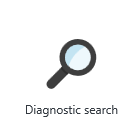
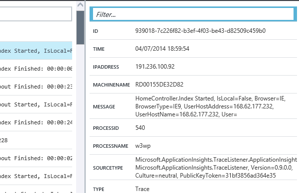
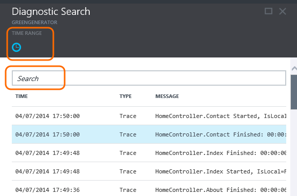

<properties title="Search diagnostic logs with Application Insights" pageTitle="Search diagnostic logs" description="Search logs generated with Trace, NLog, or Log4Net." metaKeywords="analytics web test" authors="awills"  />

<tags ms.service="application-insights" ms.workload="tbd" ms.tgt_pltfrm="ibiza" ms.devlang="na" ms.topic="article" ms.date="01/01/1900" ms.author="awills" />
 
# Search diagnostic logs with Application Insights

You can capture and search diagnostic data from System.Diagnostics.Trace, NLog, and Log4Net. Application Insights provides an efficient and easy-to-use tool for collecting and investigating logged events from one or more sources, complementing the application health monitoring features.

The monitored web application can be hosted on-premise or in a virtual machine, or it can be a Microsoft Azure website.

1. [Add a logging adapter](#add)
+ [Insert log statements, build and deploy](#deploy)
+ [View log data](#view)
+ [Search the data](#search)
+ [Next steps](#next)

## 1. Add a logging adapter

1. If you haven't done this already, [add Application Insights to your web service project][start] in Visual Studio. 

    If you add Application Insights after you add logging to your project, you'll find that the logging adapter has already been set up and configured - just [redeploy your project](#deploy) and [view your data](#view).

2. In Solution Explorer, in the context menu of your project, choose **Manage NuGet Packages**.
3. Select Online > All, select **Include Prerelease** and search for "Microsoft.ApplicationInsights"

    

    The NuGet package modifies web.config or app.config, in addition to installing the necessary assemblies.

4. Select the prerelease version of the appropriate package - one of:
  + Microsoft.ApplicationInsights.TraceListener
  + Microsoft.ApplicationInsights.NLogTarget
  + Microsoft.ApplicationInsights.Log4NetAppender

## 2. Insert log statements, build and deploy

Insert event logging calls using your chosen logging framework. For example if you use Trace, you might have calls like:

    System.Diagnostics.Trace.TraceWarning("Slow response - database01");

Or if you prefer to use log4net:

    log.Warn("Slow response - database01");

Logged events will be sent to Application Insights both in development and in operation.

## 3. View log data

In Application Insights, open diagnostic search.

Select any log event to see its detail. 

The available fields depend on the logging framework and the parameters you used in the call.

You can use plain strings (without wildcards) to filter the field data within an item.

## 4. Search the data

Set a time range and search for terms. Searches over a shorter range are faster. 

Notice that you search for terms, not substrings. Terms are alphanumeric strings including some punctuation such as '.' and '_'. For example:

<table>
  <tr><th>term</th><th>is NOT matched by</th><th>but these do match</th></tr>
  <tr><td>HomeController.About</td><td>about home</td><td>h*about home*</td></tr>
  <tr><td>IsLocal</td><td>local is *local</td><td>isl* islocal i*l</td></tr>
  <tr><td>New Delay</td><td>w d</td><td>new delay n* AND d*</td></tr>
</table>

Here are the search expressions you can use:

<table>
                    <tr>
                      <th>
                        
Sample query

                      </th>
                      <th>
                        
Effect

                      </th>
                    </tr>
                    <tr>
                      <td>
                        

                          slow
                        

                      </td>
                      <td>
                        
Find all events in the date range whose fields include the term "slow"

                      </td>
                    </tr>
                    <tr>
                      <td>
                        

                          database??
                        

                      </td>
                      <td>
                        
Matches database01, databaseAB, ...

                        
? is not allowed at the start of a search term.

                      </td>
                    </tr>
                     <tr>
                      <td>
                        

                          database*
                        

                      </td>
                      <td>
                        
Matches database, database01, databaseNNNN

                        
* is not allowed at the start of a search term

                      </td>
                    </tr>
                   <tr>
                      <td>
                        

                          apple AND banana
                        

                      </td>
                      <td>
                        
Find events that contain both terms. Use capital "AND", not "and".

                      </td>
                    </tr>
                    <tr>
                      <td>
                        

                          apple OR banana
                        

                        

                          apple banana
                        

                      </td>
                      <td>
                        
Find events that contain either term. Use "OR", not "or".

                        
Short form.

                      </td>
                    </tr>
                    <tr>
                      <td>
                        

                          apple NOT banana
                        

                        

                          apple -banana
                        

                      </td>
                      <td>
                        
Find events that contain one term but not the other.

                        
Short form.

                      </td>
                    </tr>
                    <tr>
                      <td>
                        
app* AND banana NOT (grape OR pear)

                        

                          app* AND banana -(grape pear)
                        

                      </td>
                      <td>
                        
Logical operators and bracketing.

                        
Shorter form.

                      </td>
                    </tr>
                    <tr>
                      <td>
                        

                          message:slow
                        

                        

                          ipaddress:(10.0.0.* OR 192.168.0.*)
                        

                        

                          properties.logEventInfo.level:Error
                        

                      </td>
                      <td>
                        
Match the specified field. By default, all fields are searched. To see what fields are available, select an event to look at its detail.

                      </td>
                    </tr>
</table>

## Next steps

* [Add Application Insights to a project][start]
* [Set up availability and responsiveness tests][availability]
* [Troubleshooting][qna]

## Learn more

* [Application Insights][root]
* [Add Application Insights to your project][start]
* [Monitor a live web server now][redfield]
* [Explore metrics in Application Insights][explore]
* [Diagnostic log search][diagnostic]
* [Availability tracking with web tests][availability]
* [Usage tracking with events and metrics][usage]
* [Q & A and troubleshooting][qna]

<!--Link references-->

[root]: ../app-insights-get-started/
[start]: ../app-insights-monitor-application-health-usage/
[redfield]: ../app-insights-monitor-performance-live-website-now/
[explore]: ../app-insights-explore-metrics/
[diagnostic]: ../app-insights-search-diagnostic-logs/ 
[availability]: ../app-insights-monitor-web-app-availability/
[usage]: ../app-insights-track-usage-custom-events-metrics/
[qna]: ../app-insights-troubleshoot-faq/

