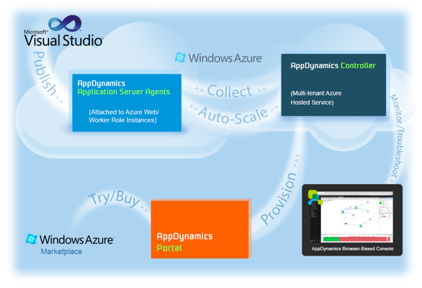
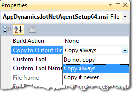
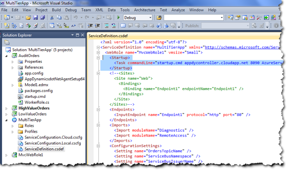

<properties linkid="manage-services-how-to-use-appdynamics" urlDisplayName="Monitor with AppDynamics" pageTitle="How to use AppDynamics with Azure" metaKeywords="" description="Learn how to use AppDynamics for Azure." metaCanonical="" services="cloud-services" documentationCenter="" title="How To Use AppDynamics for Azure" authors="ryanwi" solutions="" manager="" editor="" />

<tags ms.service="cloud-services" ms.workload="tbd" ms.tgt_pltfrm="na" ms.devlang="na" ms.topic="article" ms.date="01/01/1900" ms.author="ryanwi" />

#How To Use AppDynamics for Azure#

This topic describes how to get started with AppDynamics for Azure.

##Table of Contents##

* [What is AppDynamics?](#what)
* [Prerequisites](#prereq)
* [Register for an AppDynamics Account](#register)
* [Download the .NET Agent from AppDynamics](#download)
* [Add the .NET Agent to Azure Roles and Modify Startup](#addagent)
* [Publish the AppDynamics-Instrumented Application to Azure](#publish)
* [Monitor Your Application](#monitor)

<h2>What is AppDynamics?</h2>

AppDynamics is an application performance monitoring solution that helps you:

- Identify problems, such as slow and stalled user requests and errors, in a production environment

- Troubleshoot and isolate the root cause of such problems

There are two components in AppDynamics:

- Application Server Agent: The Application Server .NET Agent collects data from your servers. You run a separate Agent on every role instance that you want to monitor. You can download the Agent from the AppDynamics portal.

- AppDynamics Controller: The Agent sends its information to an AppDynamics Controller hosted service on Azure. Using a web browser-based console, you log into the Controller to monitor, analyze and troubleshoot your application.

	

<h2>Prerequisites</h2>

- Visual Studio 2010 or later
- A Visual Studio solution to be monitored
- Azure SDK
- Azure account

<h2>Register for an AppDynamics Account</h2>

To register for an AppDynamics for Azure account:

1. Click **Try Free** or **Sign Up** for AppDynamics on the Azure Marketplace at [https://datamarket.azure.com/browse/Applications](https://datamarket.azure.com/browse/Applications).

	If you choose **Sign Up**, you receive a free version of AppDynamics Pro for Azure with full functionality, which downgrades after 30 days to a free version of AppDynamics Lite for Azure with limited functionality. You do not need to provide a credit card for this option. You can upgrade to AppDynamics Pro for Azure at any time.

	If you choose **Try Free**, you receive a free version of AppDynamics Pro for Azure with full functionality. You need to provide a credit card for this option. After 30 days your credit account will be charged for continued use of AppDynamics Pro for Azure, unless you cancel your subscription.

	You need one agent license for each role instance that you wish to monitor. For example, a site running 2 Web role instances and 2 Worker role instances requires 4 agent licenses.

2. On the registration page, provide your user information, a password, email address, company name, and the name of the application you are monitoring as you will publish it with Azure.

3. Click **Register Now**.

	You will receive your AppDynamics credentials and the AppDynamics Controller URL (host and port) assigned to your account in an email sent to the address you provide on the sign-up page. Save this information.

	If you already have AppDynamics credentials from another product, you can sign in using them.

	You will also be given an AppDynamics account home page.   

	You will land on your AppDynamics account home page.

	Your AppDynamics account home page includes:

	- Controller URL: from which to log into your account on the AppDynamics controller hosted service

	- AppDynamics credentials: Account Name and Access Key

	- Link to the AppDynamics download site: from which to download the AppDynamics .NET Agent

	- Number of days left in your Pro trial

	- Links to the AppDynamics on-boarding videos and documentation

	You can access your AppDynamics account home page at any time by entering its URL in a web browser and signing in with your AppDynamics credentials.

<h2>Download the .NET Agent from AppDynamics</h2>

1. Navigate to the AppDynamics download site. The URL is in your welcome email and on your AppDynamics account home page.

2. Log in with your AppDynamics account name and access key.

3. Download the file named AppDynamicsdotNetAgentSetup64.msi. Do not run the file.

<h2>Add the .NET Agent to Azure Roles and Modify Startup</h2>

This step instruments the roles in your Visual Studio solution for monitoring by AppDynamics. There is no traditional Windows wizard-style installation procedure required to use AppDynamics for Azure.

1. Either create a new Azure project in Visual Studio or open an existing Azure project.

2. If you created a new project, add the Web role and/or Worker role projects to the solution.

3. To each Web and Worker role project that you want to monitor add the downloaded .NET Agent .msi file. 

	Note that while each *role project* has a single attached .NET Agent .msi, each *role instance* in the project requires a separate .NET Agent license.

4. To each Web and Worker role project that you want to monitor add a text file named startup.cmd and paste the following lines in it:
   
		if defined COR_PROFILER GOTO END 
		SETLOCAL EnableExtensions 
		REM Run the agent installer 
		AppDynamicsdotNetAgentSetup64.msi AD_Agent_Environment=Azure AD_Agent_ControllerHost=%1 AD_Agent_ControllerPort=%2 AD_Agent_AccountName=%3 AD_Agent_AccessKey=%4 AD_Agent_ControllerApplication=%5 /quiet /log d:\adInstall.log  
		SHUTDOWN /r /c "Rebooting the instance after the installation of AppDynamics Monitoring Agent" /t 0 
		GOTO END   
		:END

5. For each Web and Worker role that you want to monitor, set the **Copy to Output Directory** property for the AppDynamics agent .msi file and for the startup.cmd file to **Copy Always**.

	

6. In the ServiceDefinition.csdef file for the Azure project, add a Startup Task element that invokes startup.cmd with parameters for each WorkerRole and WebRole element.  

	Add the following lines:

		<Startup>
		<Task commandLine="startup.cmd [your_controller_host] [your_controller_port] [your_account_name] [your_access_key] [your_application_name]" executionContext="elevated" taskType="simple"/>
		</Startup>
	
	where:
	
	- *your controller host* and *your controller port* are the Controller host and port assigned to your account, and *your account name* and *your access key* are the credentials assigned to you by AppDynamics. This information is provided in the email sent when you registered with AppDynamics and also on your AppDynamic home page. See [Register for an AppDynamics Account](#register).

		
	- *your application name* is the name you choose for the application. This name will identify the application in the AppDynamics Controller interface.

	Your ServiceDefinition.csdef file will look something like this: 

	

##Publish the AppDynamics-Instrumented Application to Azure

For each AppDynamics-instrumented role project:

1. In Visual Studio, select the role project.

2. Select Publish to Azure.

##Monitor Your Application

1. Log into the AppDynamics Controller at the URL given in your welcome email and on your AppDynamics account home page.

2. Send some requests to your application so there is some traffic to monitor and wait a few minutes.

3. In the AppDynamics Controller, select your application.

4. Monitor your application.

##Learn More

See your AppDynamics account home page for links to documentation and videos.

The latest updates to this document are in the wiki version at [http://docs.appdynamics.com/display/ADAZ/How+To+Use+AppDynamics+for+Windows+Azure](http://docs.appdynamics.com/display/ADAZ/How+To+Use+AppDynamics+for+Windows+Azure). 

