<properties linkid="configure-hyper-v-recovery-vault" urlDisplayName="configure-Azure-Site-Recovery" pageTitle="Configure Site Recovery to protect virtual machines on Hyper-V server located in VMM clouds" metaKeywords="Azure Site Recovery, VMM, clouds, disaster recovery" description="Azure Site Recovery coordinates the replication, failover and recovery of Hyper-V virtual machines located in VMM clouds from one on-premises site to another. Azure Site Recovery can also replicate, failover and recover Hyper-V virtual machine data between in VMM clouds and Microsoft Azure." metaCanonical="" umbracoNaviHide="0" disqusComments="1" title="Getting Started with Azure Site Recovery: On-Premises to On-Premises Protection" editor="jimbe" manager="cfreeman" authors="raynew" />

<tags ms.service="site-recovery" ms.workload="backup-recovery" ms.tgt_pltfrm="na" ms.devlang="na" ms.topic="article" ms.date="01/01/1900" ms.author="raynew" />

# Getting Started with Azure Site Recovery:  On-Premises to On-Premises Protection

 

Use Azure Site Recovery to protect virtual machines running on Hyper-V hosts located in System Center Virtual Machine Manager (VMM) clouds. You can configure:

<ul>
<li><b>On-premises to on-premises protection</b>—Replicate virtual machines located on Hyper-V host servers in VMM clouds from one on-premises site to another. You configure and enable protection settings in Azure Site Recovery vaults. Virtual machine data is replicated from one on-premises Hyper-V server to another. Azure Site Recovery simply orchestrates the process.</li>
<li><b>On-premises to Azure protection</b>—Replicate on-premise virtual machines located on Hyper-V host servers in VMM clouds to Azure. You configure and enable protection settings in Azure Site Recovery vaults. Virtual machine data is replicated from the on-premises Hyper-V server to Azure storage. Learn about this scenario in <a href="http://go.microsoft.com/fwlink/?LinkId=398764">Getting Started with Azure Site Recovery: On-Premises to Azure Protection</a>.</li>
</ul>

<h2>About this tutorial</h2>

This tutorial is intended to help you deploy Azure Site Recovery for a quick proof-of-concept. It uses the quickest path and default settings where possible. Including steps to:

<ul>
<li>Set up an Azure Site Recovery vault—Get a certificate uploaded to the vault and set up on the source VMM server, and  generate a vault key.</li>
<li>Set up VMM servers—Install the Azure Site Recovery Provider on the source and target VMM server.</li>
<li>Configure the VMM clouds—Configure protection settings for VMM clouds.</li>
<li>Enable virtual machines—Enable protection for virtual machines.</li>
<li>Run a failover—Create a recovery plan and run a test failover.</li>
</ul>

For information about a full deployment read:

<UL>
<LI><a href="http://go.microsoft.com/fwlink/?LinkId=321294">Plan for Azure Site Recovery Deployment</a>—Describes the planning steps you should complete before a starting a full deployment.</LI>
<LI><a href="http://go.microsoft.com/fwlink/?LinkId=321295">Deploy Azure Site Recovery: On-Premises to On-Premises Protection</a>—Provides step-by-step instructions for a full deployment.</LI>
<LI><a href="http://go.microsoft.com/fwlink/?LinkId=378272">Administer and Monitor Azure Site Recovery</a>—Describes how to run failovers, and to manage and monitor your deployment.</LI>
</UL>

If you run into problems during this tutorial, review the wiki article <a href="http://go.microsoft.com/fwlink/?LinkId=389879">Azure Site Recovery: Common Error Scenarios and Resolutions</a>, or post your questions on the <a href="http://go.microsoft.com/fwlink/?LinkId=313628">Azure Recovery Services Forum</a>.

<h2>Before you begin</h2> 

 

Before you start this tutorial check the prerequisites.

<h3>Azure prerequisites</h3>

<UL>
<LI><b>Azure account</b>—You'll need an Azure account. If you don't have one, see <a href="http://aka.ms/try-azure">Azure free trial</a>. Get pricing information at <a href="http://go.microsoft.com/fwlink/?LinkId=378268">Azure Site Recovery Manager Pricing Details</a>.</LI>
<LI>Certificate</b>—You'll need to upload a management certificate (.cer) with a public key to the vault. You'll export this certificate as a .pfx file (with private key) and import it on each VMM server you want to register in the vault. For this tutorial you'll use a self-signed certificate. For a full deployment you can use a valid SSL certificate that complies with the conditions described in the <a href=" http://go.microsoft.com/fwlink/?LinkId=386485">planning guide</a>. </LI>
</UL></LI>
</UL>

<h3>VMM prerequisites</h3>

<UL>
<LI><b>VMM server</b>—At least one VMM server running on System Center 2012 SP1 or System Center 2012 R2.</LI>
<LI><b>VMM clouds</b>—At least one cloud on the source VMM server you want to protect, and one cloud on the target VMM server. If you're running one VMM server it'll need two clouds configured. The primary cloud you want to protect must contain the following:<UL>
	<LI>One or more VMM host groups</LI>
	<LI>One or more Hyper-V host servers or clusters in each host group.</LI>
	<li>One or more virtual machines located on the source Hyper-V server in the cloud.</li>
		</UL></LI>
	

</UL>

<h2>Tutorial steps</h2> 

After verifying the prerequisites, do the following:
<UL>
<LI><a href="#createcert">Step 1: Obtain and configure certificates</a>—Obtain a .cer certificate, export it as a .pfx file, and import the .pfx file to VMM servers.</LI>
<LI><a href="#vault">Step 2: Create a vault</a>—Create an Azure Site Recovery vault.</LI>
<LI><a href="#upload">Step 3: Configure the vault</a>—Upload a management certificate to the vault, and generate a key for the vault. The key is used to ensure that the Provider located on the VMM server only runs commands sent by Azure Site Recovery.</LI>
<LI><a href="#download">Step 4: Install the Provider application</a>—Run the Microsoft Azure Site Recovery Provider application on each VMM server. This installs the Provider and registers the VMM servers in the vault.</LI>
<LI><a href="#clouds">Step 5: Configure cloud protection</a>—Configure protection settings for VMM clouds.</LI>
<LI><a href="#networkmapping">Step 6: Configure network mapping—You can optionally configure network mapping to map source VM networks to target VM networks.</LI>
<LI><a href="#storagemapping">Step 7: Configure storage mapping</a>—You can optionally configure storage mapping to map storage classifications on the source VMM server to storage classifications on the target server.</LI>
<LI><a href="#enablevirtual">Step 8: Enable protection for virtual machines</a>—Enable protection for virtual machines located in protected VMM clouds</LI>
<LI><a href="#recovery plans">Step 9: Configure and run recovery plans</a>—Create a recovery plan and run a test failover for the plan.</LI>

</UL>

 <h2>Step 1: Obtain and configure certificates</h2>

Obtain and configure certificates as follows:
<OL>
<LI><a href="#obtaincert">Obtain a self-signed certificate for the walkthrough</a>—Obtain a certificate using the MakeCert tool.</LI>
<LI><a href="#exportcert">Export the certificate in .pfx format</a>—On the server on which you created the certificate, export the .cer file as a .pfx file (with the private key). </LI>
<LI><a href="#importcert">Import the .pfx certificate to VMM servers</a>—After export, import the .pfx file into the Personal folder of the Local Computer store on the VMM servers that you want to register with the vault.</LI>
</OL>

<h3>Obtain a self-signed certificate (.cer)</h3>

Create a .cer x.509 certificate that complies with all certificate requirements:

<ol>
<LI>
On the computer on which you want to run MakeCert, download the latest version of the <a href="http://go.microsoft.com/fwlink/?LinkId=378269">Windows SDK</a>. You won't need to install the entire SDK.</LI>
<LI>On the Specify Location page, select <b>Install the Windows Software Development Kit for Windows 8.1 to this computer</b>.</LI>
<LI>On the Select the Features you Want to Install page, clear all options except <b>Windows Software Development Kit</b>.</LI>
<LI>After the installation is complete, verify that makecert.exe appears in the folder C:\ProgramFiles (x86)\Windows Kits\<i>WindowsVersion</i>\bin\x64.</LI>
<LI>Open a command prompt (cmd.exe) with Administrator privileges and navigate to the makecert.exe folder.</LI> 
<LI>Run the following command to create your self-signed certificate. Replace CertificateName with the name you want to use for the certificate, and specify the actual expiration date of your certificate after -e:</LI>
<code>
makecert.exe -r -pe -n CN=CertificateName -ss my -sr localmachine -eku 1.3.6.1.5.5.7.3.2 -len 2048 -e 01/01/2016 CertificateName.cer</code>
</ol>

A succeeded status indicates that the certificate has been created. It's stored in the same folder as makecert.exe. You might want to move it to a more accessible location for export.

<h3>Export the certificate in .pfx format</h3>

Complete the steps in this procedure to export the .cer file in .pfx format.

<ol>
<li>A succeeded status indicates that the certificate has been created. It's stored in the same folder as makecert.exe. You might want to move it to a more accessible location for export.</li>
<li>In the details pane, click the certificate you want to manage.</li>
<li>On the <b>Action</b> menu, point to <b>All Tasks</b>, and then click <b>Export</b>. The Certificate Export Wizard appears. Click <b>Next</b>.</li>
<li>On the <b>Export Private Key</b> page, click <b>Yes</b> to export the private key. Click <b>Next</b>. Note that this is only required if you want to export the private key to other servers after the installation.</li>
<li>On the Export File Format page, select <b>Personal Information Exchange – PKCS #12 (.PFX)</b>. Click <b>Next</b>.</li>
<li>On the <b>Password</b> page, type and confirm the password that is used to encrypt the private key. Click <b>Next</b>.</li>
<li>Follow the pages of the wizard to export the certificate in .pfx format.</li>
</ol>

<h3>Import the .pfx certificate to VMM servers</h3>

AfAfter export copy the .pfx to the VMM servers, and then import it. Note that if you ran MakeCert.exe on a VMM server, you don't need to import the certificate on that server.

 
<ol>
<li>Copy the private-key (.pfx) certificate files to a location on the local server.</li>
<li>In the Certificates MMC snap-in select <b>Computer account</b> and then click <b>Next</b>.</li>
<li>Select <b>Local Computer</b>, and click <b>Finish</b>.</li>
<li>In the MMC, expand <b>Certificates</b>, right-click <b>Personal</b>, point to <b>All Tasks</b>, and then click <b>Import</b> to start the Certificate Import Wizard.</li>
<li>On the File to Import page, click <b>Browse</b> and locate the folder that contains the .pfx certificate file that contains the certificate that you want to import. Select the appropriate file, and then click <b>Open</b>.</li>
<li>On the Password page, in the <b>Password</b> box, type the password for the private key .pfx file and click <b>Next</b>.</li>
<li>On the Certificate Store page, select <b>Place all certificates in the following store</b>, click <b>Browse</b>, select the <b>Personal</b> store, click <b>OK</b>, and then click <b>Next</b>. Complete the wizard.</li>
</ol>

After you complete these steps, you'll be able to choose the .cer certificate for upload when you configure the vault, and to select the .pfx certificate when you register a VMM server during Provider installation.

 <h2>Step 2: Create a vault</h2>

1. Sign in to the [Management Portal](https://manage.windowsazure.com).

2. Expand <b>Data Services</b>, expand <b>Recovery Services</b>, and click <b>Site Recovery Vault</b>.

3. Click <b>Create New</b> and then click <b>Quick Create</b>.
	
4. In <b>Name</b>, enter a friendly name to identify the vault.

5. In <b>Region</b>, select the geographic region for the vault. Available geographic regions include East Asia, West Europe, West US, East US, North Europe, Southeast Asia.

6. Click <b>Create vault</b>. 

	

Check the status bar to confirm that the vault was successfully created. The vault will be listed as <b>Active</b> on the main Recovery Services page.

 <h2>Step 3: Configure the vault</h2>

1. In the <b>Recovery Services</b> page, click the vault to open the Quick Start page. Quick Start can also be opened at any time using the icon.

	

2. In the <b>Setup Recovery</b> dropdown list, select <b>Between two on-premises sites</b>.
3. To upload the certificate (.cer) to the vault, click <b>Manage Certificate</b>.

	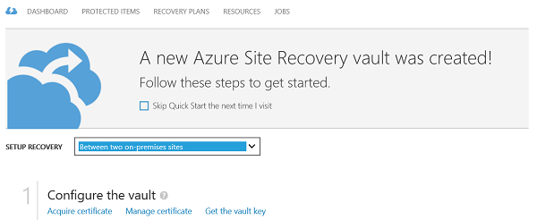

3. In the <b>Manage Certificate</b> dialog box, click <b>Browse for file</b> and select the .cer file.

	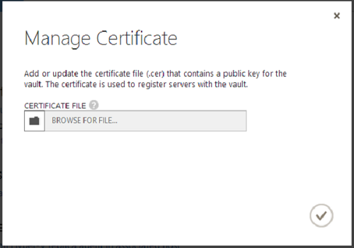

4. To generate a key for the vault, click **Get the vault key**. The key is generated automatically. If you regenerate a key it overwrites the previous key. Note  that you'll need this key later when you install the Azure Site Recovery Provider on the VMM server.

	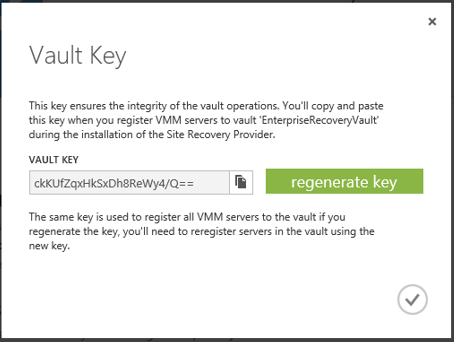

 <h2>Step 4: Install the Azure Site Recovery Provider</h2>
	

1. On the <b>Quick Start</b> page, click <b>Download Provider</b> to obtain the latest version of the Provider installation file.

	

2. Run this file on the source and target VMM servers.

	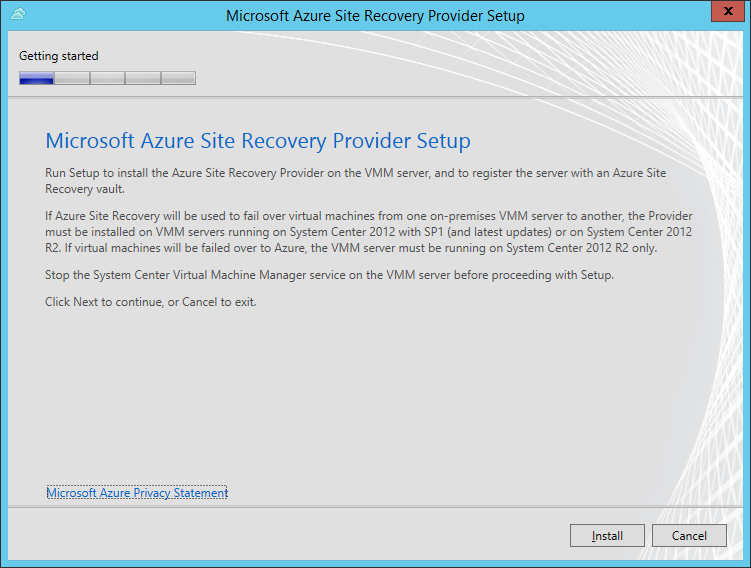

3. After the Provider is installed, continue Setup to register the server in the vault.

	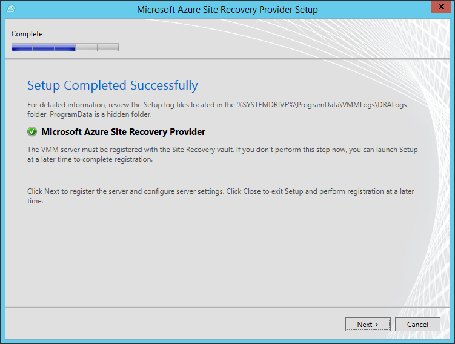

4. On the Internet Connection page specify how the Provider running on the VMM server connects to the Internet. Click  <b>Next</b> to use the default Internet connection settings configured on the server.

	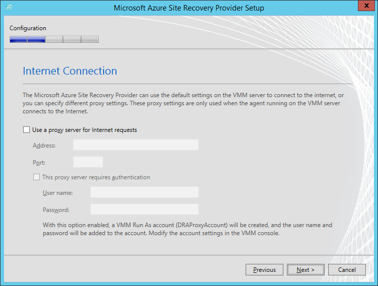

5. On the Vault Registration page, do the following:
	<ul>
	<li>Select the private key (.pfx) that you imported to the VMM server.</li>
	<li>Select the vault in which you want to register the server.</li>
	<li>Specify in the vault key. This is the vault key you generated earlier. Cut and paste the key value from the Quick Start page.</li>
	</ul>

	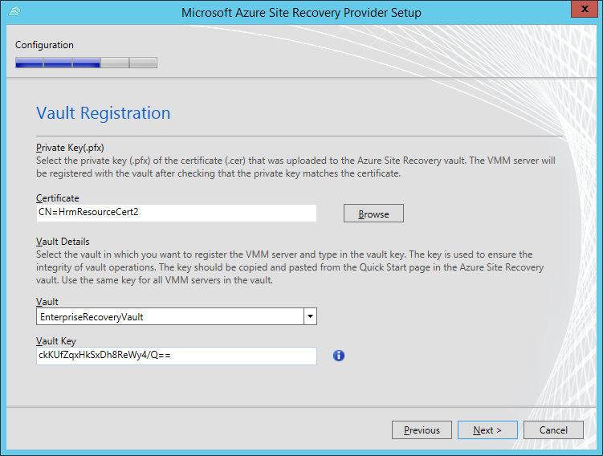

6. On the Data Encryption page, you specify whether you want to allow the option to encrypt data during replication for a specific cloud. If you select this option, an SSL certificate will be automatically generated. When you run a failover, you’ll need to select this certificate. After you enable this setting, you can enable or disable data encryption for a cloud in the Azure Site Recovery portal. For this tutorial leave the default setting and click <b>Next</b>.

	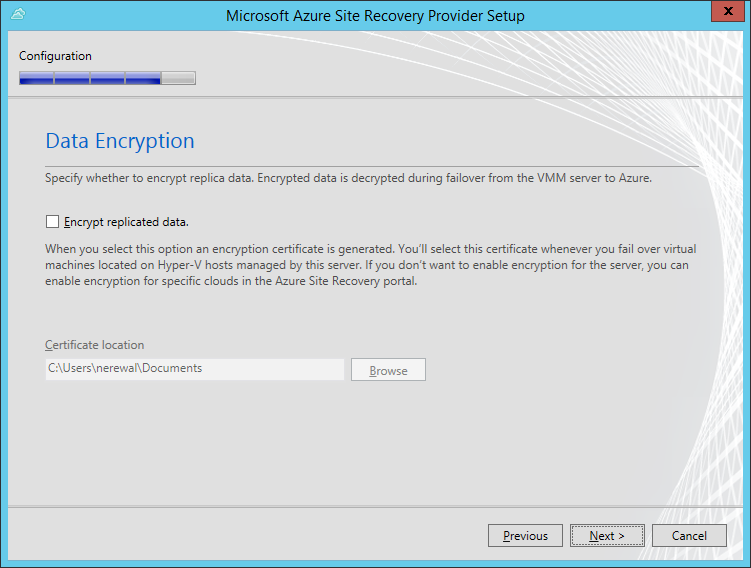

7. On the VMM Server page, do the following:

	- Specify a friendly name for the VMM server. This name is used to identify the server in the Azure Site Recovery console.
	- Select <b>Synchronize cloud metadata with the vault</b> to synchronize information about VMM clouds with Azure Site Recovery vault. This action only needs to happen once on each server. If you don't want to synchronize all clouds, you can publish each cloud individually to synchronize it, before you configure cloud protection settings. 

8. Click <b>Register</b> to complete the process. 

	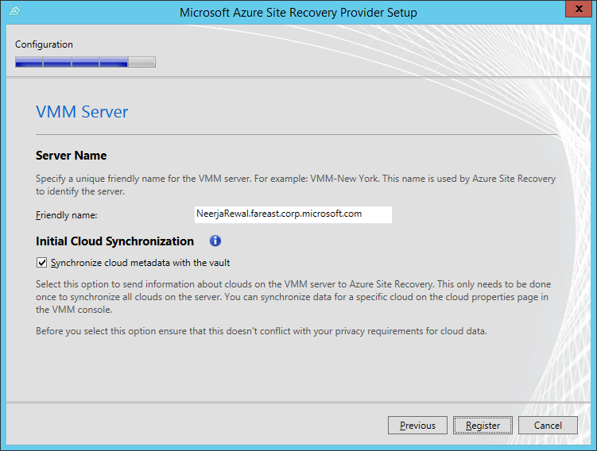

After a server has been successfully registered its friendly name will be displayed on the <b>Resources</b> tab on the Servers page in the vault.

<h2>Step 5: Configure cloud protection settings</h2>

After VMM servers are registered, you can configure cloud protection settings. You enabled the option **Synchronize cloud data with the vault** when you installed the Provider so all clouds on the VMM server will appear in the <b>Protected Items</b> tab in the vault.

1. On the Quick Start page, click **Set up protection for VMM clouds**.

2. On the **Protected Items** tab, select the cloud that you want to configure and go to the **Configuration** tab. Note that:

3. In <b>Target</b>, select <b>VMM</b>.
4. In <b>Target location</b>, select the on-site VMM server that manages the cloud you want to use for recovery.
4. In <b>Target cloud</b>, select the target cloud you want to use for failover of virtual machines in the source cloud. Note that:
	- We recommend that you select a target cloud that meets recovery requirements for the virtual machines you'll protect.
	- A cloud can only belong to a single cloud pair — either as a primary or a target cloud.

6. In <b>Copy frequency</b> leave the default setting. This value specifies how frequently data should be synchronized between source and target locations. It's only relevant when the Hyper-V host is running Windows Server 2012 R2. For other servers a default setting of five minutes is used.
7. In <b>Additional recovery points</b>, leave the default setting. This value specifies whether you want to create addition recovery points.The default zero value specifies that only the latest recovery point for a primary virtual machine is stored on a replica host server.
8. In <b>Frequency of application-consistent snapshots</b>, leave the default setting. This value specifies how often to create snapshots. Snapshots use Volume Shadow Copy Service (VSS) to ensure that applications are in a consistent state when the snapshot is taken.  If you do want to set this value for the tutorial walkthrough, ensure that it is set to less than the number of additional recovery points you configure.
	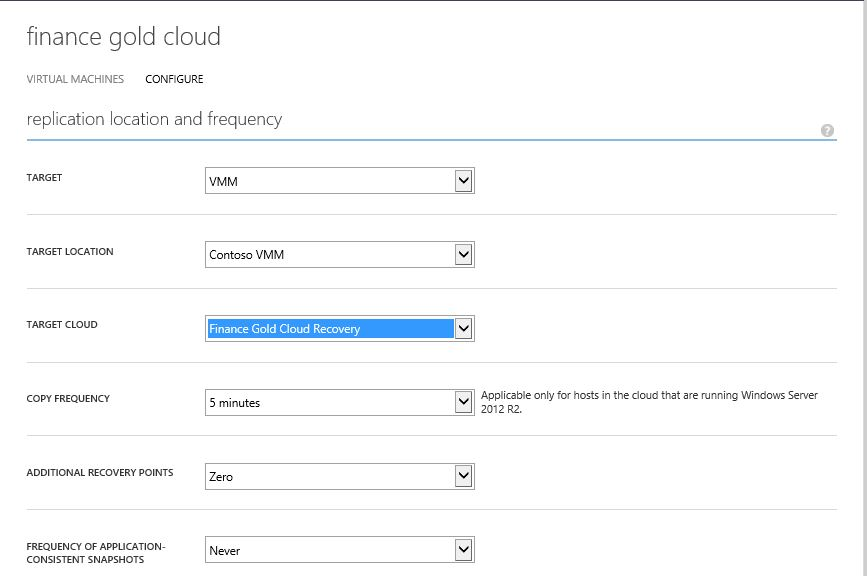
9. In <b>Data transfer compressed</b>, specify whether replicated data that is transferred should be compressed. 
10. In <b>Authentication</b>, specify how traffic is authenticated between the primary and recovery Hyper-V host servers. For the purpose of this walkthrough select HTTPS unless you have a working Kerberos environment configured. Azure Site Recovery will automatically configure certificates for HTTPS authentication. No manual configuration is required. Note that this setting is only relevant for Hyper-V host servers running on Windows Server 2012 R2.
11. In <b>Port</b>, leave the default setting. This value sets the port number on which the source and target Hyper-V host computers listen for replication traffic.
12. In <b>Replication method</b>, specify how the initial replication of data from source to target locations will be handled, before regular replication starts. 
	- <b>Over network</b>—Copying data over the network can be time-consuming and resource-intensive. We recommend that you use this option if the cloud contains virtual machines with relatively small virtual hard disks, and if the primary VMM server is connected to the secondary VMM server over a connection with wide bandwidth. You can specify that the copy should start immediately, or select a time. If you use network replication, we recommend that you schedule it during off-peak hours.
	- <b>Offline</b>—This method specifies that the initial replication will be performed using external media. It's useful if you want to avoid degradation in network performance, or for geographically remote locations. To use this method you specify the export location on the source cloud, and the import location on the target cloud. When you enable protection for a virtual machine, the virtual hard disk is copied to the specified export location. You send it to the target site, and copy it to the import location. The system copies the imported information to the replica virtual machines. For a complete list of offline replication prerequisites, see <a href="http://go.microsoft.com/fwlink/?LinkId=323469">Step 3: Configure protection settings for VMM clouds</a> in the Deployment Guide.
	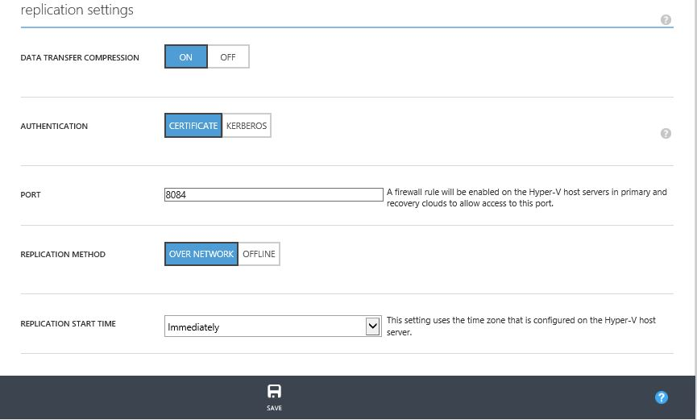

After you save the settings a job will be created and can be monitored on the <b>Jobs</b> tab. All Hyper-V host servers in the VMM source cloud will be configured for replication. Cloud settings can be modified on the <b>Configure</b> tab. If you want to modify the target location or target cloud you must remove the cloud configuration, and then reconfigure the cloud.

<h2>Step 6: Configure network mapping</h2>

This tutorial describes the simplest path to deploy Azure Site Recovery in a test environment. If you do want to configure network mapping as part of this tutorial, read <a href="http://go.microsoft.com/fwlink/?LinkId=324817">Prepare for network mapping</a> in the Planning Guide. To configure mapping follow the steps to <a href="http://go.microsoft.com/fwlink/?LinkId=402534">Configure network mapping</a> in the deployment guide.

<h2>Step 7: Configure storage mapping</h2>

This tutorial describes the simplest path to deploy Azure Site Recovery in a test environment. If you do want to configure storage mapping as part of this tutorial, follow the steps to <a href="http://go.microsoft.com/fwlink/?LinkId=402535">Configure storage mapping</a> in the deployment guide.

<h2>Step 8: Enable virtual machine protection</h2>

After servers, clouds, and networks are configured correctly, you can enable protection for virtual machines in the cloud.

<OL>
<li>On the <b>Virtual Machines</b> tab in the cloud in which the virtual machine is located, click <b>Enable protection</b> and then select <b>Add virtual machines</b>. </li>
<li>From the list of virtual machines in the cloud, select the one you want to protect.</li> 
</OL>

After protection is enabled two jobs are created. The Enable Protection job runs. Then after the initial replication is completed the Finalize Protection job runs. The virtual machine is only ready for failover after these jobs have finished successfully. You can monitor progress on the <b>Jobs</b> tab.

<h2>Step 7: Configure and run a recovery plan</h2>
A recovery plan gathers virtual machines into groups so that they can fail over as a single unit. To create a recovery plan, do the following: 

1. On the <b>Recovery Plans</b> tab, click <b>Create</b>.
2. On the Specify the Recovery Page Name and Target page, select the source VMM server and  Azure as the target. 

	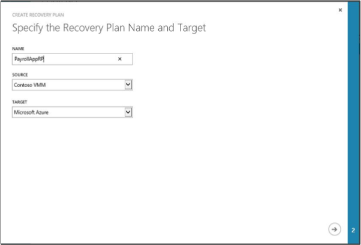

3. On the Select Virtual Machines page, select virtual machines to add to the recovery plan.  Only virtual machines with protection enabled are shown. The virtual machines are added to the recovery plan in default group (Group 1).
4. Click the check mark to create the recovery plan. 

	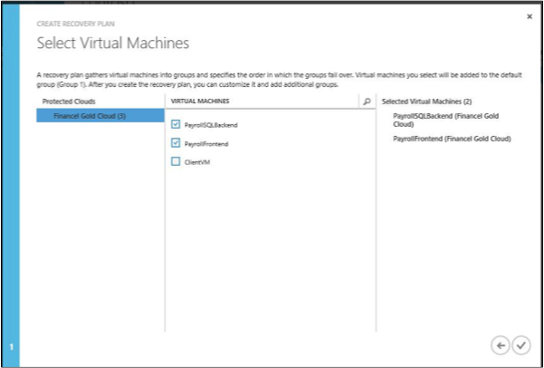

<h3>Test a failover</h3>

Recovery plans can run as part of a proactive test or planned failover, or during an unplanned failover. This walkthrough describes how to run a test failover to verify that your  failover strategy is working as expected. Test failover simulates your failover and recovery mechanism in an isolated network. Note the following:

<UL>
<li>When a test failover is triggered, you are requested to specify how test virtual machines should be connected to networks after the failover. </li>
<LI>If you want to use an existing network we recommend that you create a separate logical network  that is not used in production for this purpose.</LI>
<LI>If you select the option to automatically create a test VM network, the temporary networks and test virtual machines are cleaned up automatically after the test failover is complete.</LI>
<LI>If you are using a virtual LAN (VLAN) based logical network, ensure that the network sites you add to the logical network are isolated. </LI>
<LI>If you are using a Windows Network Virtualization-based logical network, Azure Site Recovery will automatically create isolated VM networks.</LI>
</UL>

<h5>Run the failover</h5>
Run a test failover for a recovery plan as follows:

<OL>
<LI>On the <b>Recovery Plans</b> tab, select the required recovery plan.</LI>
<LI>To initiate the failover, click the <b>Test Failover</b> button.</LI>
<LI>On the Confirm Test Failover page, specify how virtual machines should be connected to networks after the test failover, as follows:</LI>
<UL>
<LI><b>None</b>—Select this setting to specify that VM networks should not be used in the test failover. Use this option if you want to test individual virtual machines rather than your network configuration. It also provides a quick glance of how test failover functionality works. Test virtual machines will not be connected to networks after a failover.</LI>
<LI><b>Use existing</b>—Use this option if you have already created and isolated a VM network to use for test failover. After the failover all test virtual machines used in the test failover will be connected to the network specified in <b>VM Network</b>.</LI>
<LI><b>Create automatically</b>—Select this setting to specify that Azure Site Recovery should automatically create a VM network based on the setting you specify in Logical Network, and its related network sites. Use this option if the recovery plan uses more than one VM network. In the case of Windows Network Virtualization networks, this option can be used to automatically create VM networks with the same settings (subnets and IP address pools) of those in the network of the replica virtual machine. These VM networks are cleaned up automatically after the test failover is complete.</LI>
</UL>
</OL>

On the Confirm Test Failover page, details of the VMM server on which the test virtual machines will be created are displayed. You can follow the progress of test failover jobs on the <b>Jobs</b> tab. After the test failover is complete, do the following:

<OL>
<LI>Verify that the virtual machines start successfully.</LI>
<LI>After verifying that virtual machines start successfully, complete the test failover to clean up the isolated environment. If you selected to automatically create VM networks, clean up deletes all the test virtual machines and test networks.</LI>
<LI>Click <b>Notes</b> to record and save any observations associated with the test failover.</LI>
<LI>In addition to details on the <b>Jobs</b> tab, when you run a test failover for a recovery plan the  process is displayed on the recovery plan details page. You can view failover steps and status, and view or create notes for the test failover.</LI>
<li>You can export a job in the failover list into an Excel spreadsheet.</li>
</OL>

<h4>Monitor activity</h5>

You can use the <b>Jobs</b> tab and <b>Dashboard</b> to view and monitor the main jobs performed by the Azure Site Recovery vault, including configuring protection for a cloud, enabling and disabling protection for a virtual machine, running a failover (planned, unplanned, or test), and committing an unplanned failover.

From the <b>Jobs</b> tab you view jobs, drill down into job details and errors, run job queries to retrieve jobs that match specific criteria, export jobs to Excel, and restart failed jobs.

From the <b>Dashboard</b> you can download the latest versions of Provider and Agent installation files, get configuration information for the vault, see the number of virtual machines that have protection managed by the vault, see recent jobs, manage the vault certificate, and resynchronize virtual machines.

For more information about interacting with jobs and the dashboard, see the <a href="http://go.microsoft.com/fwlink/?LinkId=398534">Operations and Monitoring Guide</a>.

	
<h2>Next steps</h2>
<UL>
<LI>To plan and deploy Azure Site Recovery in a full production environment, see <a href="http://go.microsoft.com/fwlink/?LinkId=321294">Planning Guide for Azure Site Recovery</a> and <a href="http://go.microsoft.com/fwlink/?LinkId=321295">Deployment Guide for Azure Site Recovery</a>.</LI>
<LI>For questions, visit the <a href="http://go.microsoft.com/fwlink/?LinkId=313628">Azure Recovery Services Forum</a>.</LI> 
</UL>
