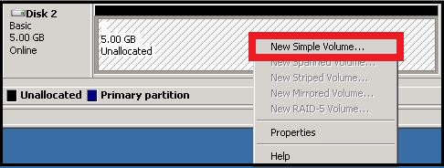

<properties linkid="manage-linux-howto-attach-a-disk" urlDisplayName="Attach a disk" pageTitle="Attach a disk to a virtual machine | Azure" metaKeywords="Azure Windows virtual machine, Azure attach disk, Azure initialize disk" description="Learn how to attach a data disk to an Azure virtual machine and initialize it so it's ready for use." metaCanonical="" services="virtual-machines,storage" documentationCenter="" title="How to Attach a Data Disk to a Virtual Machine" authors="kathydav" solutions="" manager="dongill" editor="tysonn" />

<tags ms.service="virtual-machines" ms.workload="infrastructure-services" ms.tgt_pltfrm="vm-windows" ms.devlang="na" ms.topic="article" ms.date="01/01/1900" ms.author="kathydav" />

#How to Attach a Data Disk to a Windows Virtual Machine

You can attach both empty disks and disks that contain data. In both cases, the disks are actually .vhd files that reside in an Azure storage account. Also in both cases, after you attach the disk, you'll need to initialize it so it's ready for use. 

> [WACOM.NOTE] It's a best practice to use one or more separate disks to store a virtual machine's data. When you create an Azure virtual machine, it has a disk for the operating system mapped to the C drive and a temporary disk mapped to the D drive. **Do not use the D drive to store data.** As the name implies, it provides temporary storage only. It offers no redundancy or backup because it doesn't reside in Azure storage.

- [How to: Attach an empty disk](#attachempty)
- [How to: Attach an existing disk](#attachexisting)
- [How to: Initialize a new data disk in Windows Server](#initializeinWS)

[WACOM.INCLUDE [howto-attach-disk-windows-linux](../includes/howto-attach-disk-windows-linux.md)]

##How to: Initialize a new data disk in Windows Server

1. Connect to the virtual machine by using the steps listed in [How to log on to a virtual machine running Windows Server][logon].

2. After you log on, open **Server Manager**, in the left pane, expand **Storage**, and then click **Disk Management**.

	

3. Right-click **Disk 2**, click **Initialize Disk**, and then click **OK**.

	

4. Right-click the space allocation area for Disk 2, click **New Simple Volume**, and then finish the wizard with the default values.
 

	

[logon]: ../virtual-machines-log-on-windows-server/

	The disk is now online and ready to use with a new drive letter.

	
