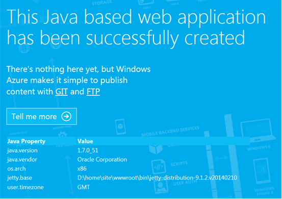

<properties linkid="develop-java-tutorials-web-site-get-started" urlDisplayName="Get started with Azure" pageTitle="Get started with Microsoft Azure Websites using Java" metaKeywords="" description="This tutorial shows you how to deploy a Java website to Microsoft Azure." metaCanonical="" services="web-sites" documentationCenter="Java" title="Get started with Azure and Java" videoId="" scriptId="" authors="robmcm" solutions="" manager="wpickett" editor="mollybos" />

<tags ms.service="web-sites" ms.workload="web" ms.tgt_pltfrm="na" ms.devlang="Java" ms.topic="article" ms.date="01/01/1900" ms.author="robmcm" />

# Get started with Azure websites and Java

This tutorial shows how to create a website on Microsoft Azure using Java, using either the Azure application gallery, or the Azure website configuration UI. 

If you don't want to use either of those techniques, for example, if you want to customize your application container, see [Upload a custom Java web site to Azure](../web-sites-java-custom-upload).

> [WACOM.NOTE] To complete this tutorial, you need a Microsoft Azure account. If you don't have an account, you can <a href="/en-us/pricing/member-offers/msdn-benefits-details/?WT.mc_id=A261C142F" target="_blank">activate your MSDN subscriber benefits</a> or <a href="/en-us/pricing/free-trial/?WT.mc_id=A261C142F" target="_blank">sign up for a free trial</a>.

# Create a Java website using the Azure application gallery

This information shows how to use the Azure application gallery to select a Java application container, either Apache Tomcat or Jetty, for your website.

The following shows how a website built using Tomcat from the application gallery would appear:

The following shows how a website built using Jetty from the application gallery would appear:

1. Log in to the Microsoft Azure Management Portal.
2. Click **New**, click **Compute**, click **Website**, and then click **From Gallery**.
3. From the list of apps, select one of the Java application servers, such as **Apache Tomcat** or **Jetty**.
4. Click **Next**.
5. Specify the URL name.
6. Select a region. For example, **West US**.
7. Click **Complete**.

Within a few moments, your website will be created. To view the website, within the Azure Management Portal, in the **Websites** view, wait for the status to show as **Running** and then click the URL for the website.

Now that you've create the website with an app container, see the **Next steps** section for information about uploading your application to the website.

# Create a Java website using the Azure configuration UI

This information shows how to use the Azure configuration UI to select a Java application container, either Apache Tomcat or Jetty, for your website.

1. Log in to the Microsoft Azure Management Portal.
2. Click **New**, click **Compute**, click **Website**, and then click **Quick Create**.
3. Specify the URL name.
4. Select a region. For example, **West US**.
5. Click **Complete**. Within a few moments, your website will be created. To view the website, within the Azure Management Portal, in the **Websites** view, wait for the status to show as **Running** and then click the URL for the website.
6. Still within the Azure Management Portal, in the **Websites** view, click the name of your website to open the 
dashboard.
7. Click **Configure**.
8. In the **General** section, enable **Java** by clicking the available version.
9. The options for the web container are displayed, for example, Tomcat and Jetty. Select the web container that you want to use. 
10. Click **Save**. 

Within a few moments, your website will become Java-based. To confirm it is Java-based, within the Azure Management Portal, in the **Websites** view, wait for the status to show as **Running** and then click the URL for the website. Note that the page will provide text stating that the new site is a Java-base website.

Now that you've create the website with an app container, see the **Next steps** section for information about uploading your application to the website.

# Next steps

At this point, you have a Java application server running as your Java website on Azure. To add in your own application or web page, see [Add an application or web page to your Java web site](../web-sites-java-add-app).
