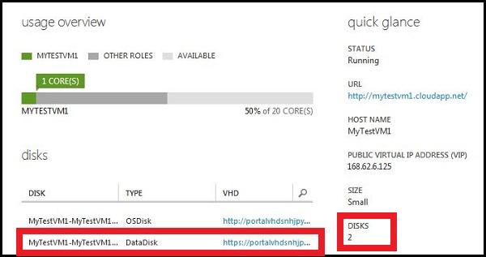
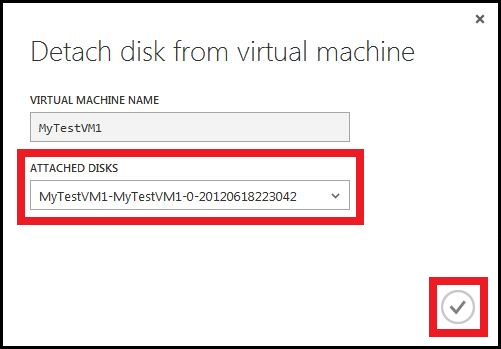

<properties writer="kathydav" editor="tysonn" manager="jeffreyg" />

#How to Detach a Data Disk from a Virtual Machine 

#

- [Concepts](#concepts)
- [How to: Find the disks that are attached to a virtual machine](#finddisks)
- [How to: Detach a data disk](#detachdisk)

## Concepts ##

A virtual machine in Azure uses different types of disks, such as an operating system disk, a local temporary disk, and optional data disks. You can attach a data disk to a virtual machine to store application data. A data disk is a virtual hard disk (VHD) that you can create either locally with your own computer or in the cloud with Azure.

You can attach and detach data disks any time you want, but you are limited in the number of disks that you can attach to a virtual machine based on the size of the machine.

When you no longer need a data disk that is attached to a virtual machine, you can easily detach it. This process does not delete the disk from storage. If you want to use the existing data on the disk again, you can easily attach the disk again to the same virtual machine, or attach it to a new virtual machine.  

For more information about using data disks, see [Manage disks and images] [].

## How to: Find disks attached to a virtual machine ##

You can find the disks that are attached to a virtual machine by using either the dashboard or the Disks page of Virtual Machines.

###Use the dashboard to find information about attached disks###

1. If you have not already done so, sign in to the Azure [Management Portal](http://manage.windowsazure.com).

2. Click **Virtual Machines**, and then select the appropriate virtual machine.

3. Click **Dashboard**. On the dashboard for the virtual machine, you can find the number of attached disks and the names of the disks. The following example shows one data disk attached to a virtual machine:

		
		
	
	
**Note:** At least one disk is attached to all virtual machines. Each virtual machine has an operating system disk attached that you cannot detach without deleting the virtual machine. The local temporary disk is not listed in the disks section because it is not persistent.

###Use the Disks page of Virtual Machines to find information about attached disks###

1. If you have not already done so, sign in to the Azure [Management Portal](http://manage.windowsazure.com).

2. Click **Virtual Machines**, and then click **Disks**. This page shows a list of all disks that are available to use with virtual machines and the disks that are being used by virtual machines. The list is a combination of operating system disks and data disks. To differentiate between the two types of disks that are attached to the virtual machine, use the dashboard.

	**Note:** When you attach a new data disk to a virtual machine, you can assign a name to the .vhd file that is used for the disk, but Azure assigns the name of the disk. The name consists of the cloud service name, the virtual machine name, and a numeric identifier.

## How to: Detach a data disk ##

After you find the name of the disk that you want to detach, you can complete the following steps to detach the disk from the virtual machine.

1. If you have not already done so, sign in to the Azure Management Portal.

2. Click **Virtual Machines**, select the virtual machine that has the data disk you want to detach, and then click **Detach The Disk**.

	

3. Select the data disk, and then click the check mark to detach it.

	

	The disk remains in storage but is no longer attached to a virtual machine.

You can now attach the disk again to the same virtual machine or to a new machine. For instructions, see [How to Attach a Data Disk to a Virtual Machine] [attachdisk].

[attachdisk]:/en-us/manage/windows/how-to-guides/attach-a-disk/

[Manage disks and images]:http://go.microsoft.com/fwlink/p/?LinkId=263439
