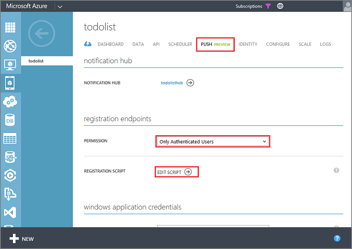

1. Log on to the [Azure Management Portal], click **Mobile Services**, and then click your mobile service.

   	

2. Click the **Push** tab, select **Only Authenticated Users** for **Permissions**, then click **Edit Script**.

   	
	
	This allows you to customize the push notification registration callback function. If you use Git to edit your source code, this same registration function is found in `.\service\extensions\push.js`.

3. Replace the existing **register** function with the following code:

		exports.register = function (registration, registrationContext, done) {   
		    // Get the ID of the logged-in user.
			var userId = registrationContext.user.userId;    
		    
			// Perform a check here for any disallowed tags.
			if (!validateTags(registration))
			{
				// Return a service error when the client tries 
		        // to set a user ID tag, which is not allowed.		
				done("You cannot supply a tag that is a user ID");		
			}
			else{
				// Add a new tag that is the user ID.
				registration.tags.push(userId);
				
				// Complete the callback as normal.
				done();
			}
		};
		
		function validateTags(registration){
		    for(var i = 0; i < registration.tags.length; i++) { 
		        console.log(registration.tags[i]);           
				if (registration.tags[i]
				.search(/facebook:|twitter:|google:|microsoft:/i) !== -1){
					return false;
				}
				return true;
			}
		}

	This adds a tag to the registration that is the ID of the logged-in user. The supplied tags are validated to prevent a user from registering for another user's ID. When a notification is sent to this user, it is received on this and any other device registered by the user.

4. Click the back arrow, click the **Data** tab, click **TodoItem**, click **Script** and select **Insert**. 